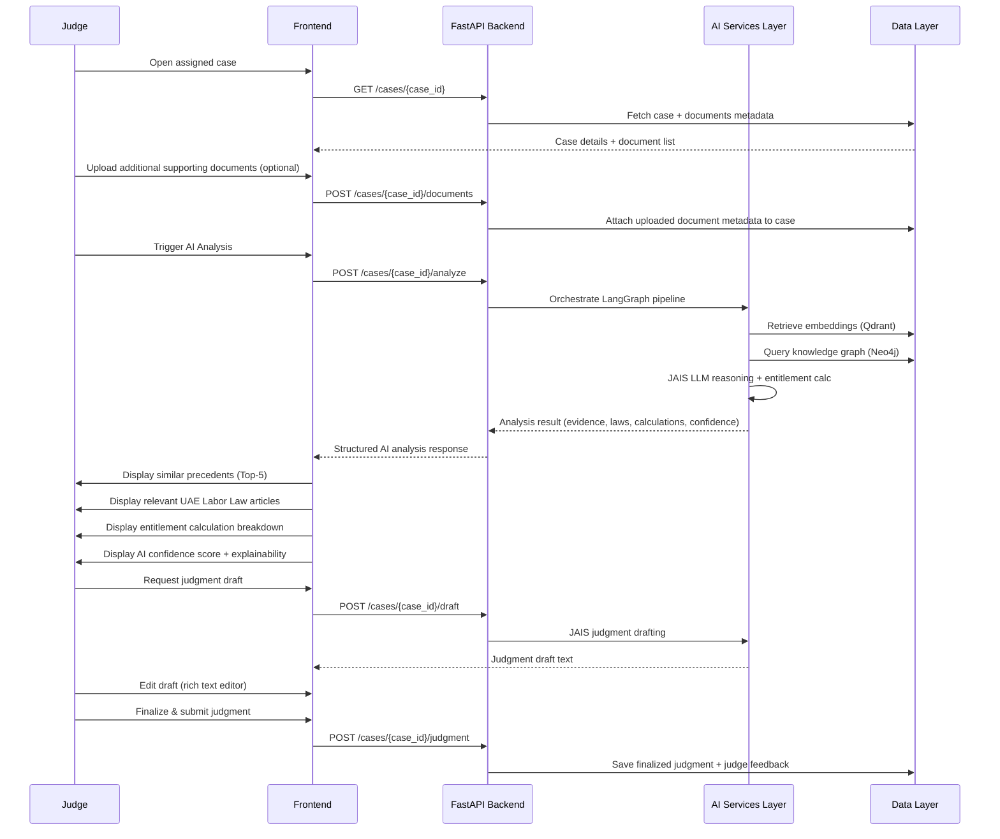
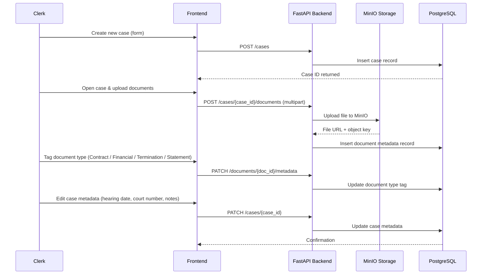
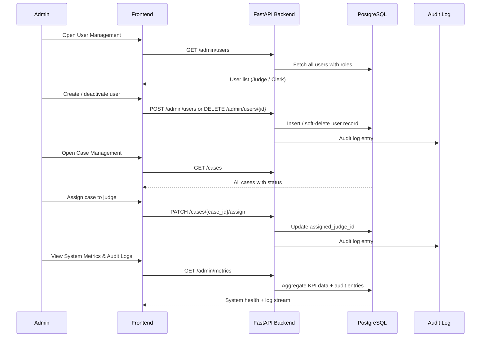
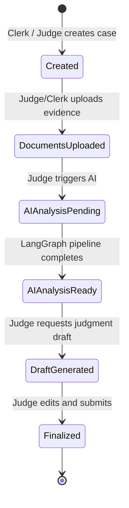

# Core Flows — AI Judicial Assistant Platform

## Overview

This document defines the three primary role-based flows for the AI Judicial Assistant Platform. All flows operate under JWT-authenticated sessions with RBAC enforcement. The platform supports Arabic and English (i18n).

---

## Flow 1 — Judge

Judges have two primary entry points: reviewing existing assigned cases and creating new cases. Both lead into the core AI-assisted case analysis workflow.

### 1A. Case Dashboard — View Assigned & Past Cases

The Judge lands on a Case Dashboard listing:

- **Assigned Cases** — active, pending judgment
- **Previous Cases** — finalized judgments (read-only)

Each case card shows: Case ID, Claimant name, case type (e.g., Unpaid Wages), status, and assigned date.

```wireframe
<!DOCTYPE html>
<html>
<head>
<style>
  body { font-family: Arial, sans-serif; margin: 0; background: #f5f5f5; }
  .topbar { background: #1a1a2e; color: white; padding: 12px 24px; display: flex; justify-content: space-between; align-items: center; }
  .topbar h1 { margin: 0; font-size: 16px; }
  .topbar span { font-size: 13px; opacity: 0.7; }
  .container { padding: 24px; max-width: 1100px; margin: auto; }
  .section-title { font-size: 14px; font-weight: bold; color: #333; margin-bottom: 12px; text-transform: uppercase; letter-spacing: 0.5px; }
  .tabs { display: flex; gap: 8px; margin-bottom: 20px; }
  .tab { padding: 8px 20px; border: 1px solid #ccc; border-radius: 4px; cursor: pointer; font-size: 13px; background: white; }
  .tab.active { background: #1a1a2e; color: white; border-color: #1a1a2e; }
  .case-grid { display: grid; grid-template-columns: repeat(3, 1fr); gap: 16px; }
  .case-card { background: white; border: 1px solid #e0e0e0; border-radius: 6px; padding: 16px; }
  .case-card .case-id { font-size: 11px; color: #888; margin-bottom: 4px; }
  .case-card .case-name { font-size: 14px; font-weight: bold; margin-bottom: 4px; }
  .case-card .case-type { font-size: 12px; color: #555; margin-bottom: 12px; }
  .status-badge { display: inline-block; padding: 3px 10px; border-radius: 12px; font-size: 11px; }
  .status-active { background: #fff3cd; color: #856404; }
  .status-final { background: #d1e7dd; color: #0f5132; }
  .open-btn { margin-top: 12px; display: block; text-align: center; padding: 7px; border: 1px solid #1a1a2e; border-radius: 4px; font-size: 12px; cursor: pointer; color: #1a1a2e; }
  .new-case-btn { padding: 9px 20px; background: #1a1a2e; color: white; border: none; border-radius: 4px; font-size: 13px; cursor: pointer; }
</style>
</head>
<body>
<div class="topbar">
  <h1>⚖️ AI Judicial Assistant</h1>
  <span>Judge Ahmed Al-Mansouri &nbsp;|&nbsp; Logout</span>
</div>
<div class="container">
  <div style="display:flex; justify-content:space-between; align-items:center; margin-bottom:20px;">
    <div class="section-title">My Cases</div>
    <button class="new-case-btn" data-element-id="create-case-btn">+ Create New Case</button>
  </div>
  <div class="tabs">
    <div class="tab active" data-element-id="tab-assigned">Assigned Cases (4)</div>
    <div class="tab" data-element-id="tab-previous">Previous Cases (12)</div>
  </div>
  <div class="case-grid">
    <div class="case-card">
      <div class="case-id">CASE-2024-0041</div>
      <div class="case-name">Ali Hassan vs. Gulf Tech LLC</div>
      <div class="case-type">Unpaid Wages</div>
      <span class="status-badge status-active">In Review</span>
      <a class="open-btn" data-element-id="open-case-1">Open Case →</a>
    </div>
    <div class="case-card">
      <div class="case-id">CASE-2024-0038</div>
      <div class="case-name">Fatima Noor vs. Al Reem Corp</div>
      <div class="case-type">Wrongful Termination</div>
      <span class="status-badge status-active">Pending AI Analysis</span>
      <a class="open-btn" data-element-id="open-case-2">Open Case →</a>
    </div>
    <div class="case-card">
      <div class="case-id">CASE-2024-0031</div>
      <div class="case-name">Samir Khalil vs. Dubai Builds</div>
      <div class="case-type">End-of-Service Benefit</div>
      <span class="status-badge status-final">Finalized</span>
      <a class="open-btn" data-element-id="open-case-3">View →</a>
    </div>
  </div>
</div>
</body>
</html>
```

---

### 1B. Judge — Case Analysis Flow



### 1C. Case Workspace Wireframe

```wireframe
<!DOCTYPE html>
<html>
<head>
<style>
  body { font-family: Arial, sans-serif; margin: 0; background: #f5f5f5; font-size: 13px; }
  .topbar { background: #1a1a2e; color: white; padding: 10px 24px; display: flex; justify-content: space-between; align-items: center; }
  .topbar h2 { margin: 0; font-size: 14px; }
  .layout { display: grid; grid-template-columns: 260px 1fr; height: calc(100vh - 42px); }
  .sidebar { background: white; border-right: 1px solid #e0e0e0; padding: 16px; overflow-y: auto; }
  .sidebar h4 { margin: 0 0 10px; font-size: 12px; color: #888; text-transform: uppercase; }
  .doc-item { padding: 8px 10px; border: 1px solid #e0e0e0; border-radius: 4px; margin-bottom: 6px; cursor: pointer; }
  .doc-item .doc-name { font-weight: bold; font-size: 12px; }
  .doc-item .doc-tag { font-size: 11px; color: #888; }
  .main { padding: 20px; overflow-y: auto; }
  .panel { background: white; border: 1px solid #e0e0e0; border-radius: 6px; padding: 16px; margin-bottom: 16px; }
  .panel h3 { margin: 0 0 12px; font-size: 13px; color: #1a1a2e; border-bottom: 1px solid #eee; padding-bottom: 8px; }
  .ai-btn { background: #1a1a2e; color: white; border: none; padding: 9px 18px; border-radius: 4px; cursor: pointer; font-size: 12px; margin-right: 8px; }
  .sec-btn { background: white; color: #1a1a2e; border: 1px solid #1a1a2e; padding: 9px 18px; border-radius: 4px; cursor: pointer; font-size: 12px; }
  .precedent-item { border: 1px solid #e0e0e0; border-radius: 4px; padding: 10px; margin-bottom: 8px; display: flex; justify-content: space-between; align-items: center; }
  .sim-score { background: #d1e7dd; color: #0f5132; padding: 3px 8px; border-radius: 10px; font-size: 11px; font-weight: bold; }
  .law-tag { display: inline-block; background: #e8f0fe; color: #1a1a2e; padding: 4px 10px; border-radius: 12px; margin: 3px; font-size: 11px; }
  .calc-row { display: flex; justify-content: space-between; padding: 6px 0; border-bottom: 1px solid #f0f0f0; }
  .calc-total { display: flex; justify-content: space-between; padding: 10px 0; font-weight: bold; color: #1a1a2e; }
  .confidence-bar { height: 8px; background: #e0e0e0; border-radius: 4px; margin-top: 6px; }
  .confidence-fill { height: 8px; background: #198754; border-radius: 4px; width: 82%; }
  textarea { width: 100%; height: 120px; border: 1px solid #e0e0e0; border-radius: 4px; padding: 10px; font-size: 13px; resize: vertical; box-sizing: border-box; }
  .finalize-btn { background: #198754; color: white; border: none; padding: 10px 24px; border-radius: 4px; cursor: pointer; font-size: 13px; margin-top: 10px; }
</style>
</head>
<body>
<div class="topbar">
  <h2>⚖️ CASE-2024-0041 &nbsp;|&nbsp; Ali Hassan vs. Gulf Tech LLC &nbsp;·&nbsp; Unpaid Wages</h2>
  <span>Judge Ahmed Al-Mansouri</span>
</div>
<div class="layout">
  <div class="sidebar">
    <h4>Case Documents</h4>
    <div class="doc-item" data-element-id="doc-1">
      <div class="doc-name">Employment Contract.pdf</div>
      <div class="doc-tag">Contract</div>
    </div>
    <div class="doc-item" data-element-id="doc-2">
      <div class="doc-name">Salary Slips Q1-Q3.pdf</div>
      <div class="doc-tag">Financial Record</div>
    </div>
    <div class="doc-item" data-element-id="doc-3">
      <div class="doc-name">Termination Letter.pdf</div>
      <div class="doc-tag">Termination Notice</div>
    </div>
    <div class="doc-item" data-element-id="doc-4">
      <div class="doc-name">Claimant Statement.pdf</div>
      <div class="doc-tag">Witness Statement</div>
    </div>
    <div style="margin-top:20px;">
      <button class="ai-btn" data-element-id="trigger-ai" style="width:100%">▶ Run AI Analysis</button>
    </div>
  </div>
  <div class="main">
    <div class="panel">
      <h3>🔍 Similar Precedent Cases</h3>
      <div class="precedent-item"><span>Case_044 — Unpaid wages, 8 months · Gulf Tech</span><span class="sim-score">0.91</span></div>
      <div class="precedent-item"><span>Case_078 — Wrongful termination, salary arrears</span><span class="sim-score">0.85</span></div>
      <div class="precedent-item"><span>Case_012 — End-of-service + unpaid overtime</span><span class="sim-score">0.79</span></div>
    </div>
    <div class="panel">
      <h3>📜 Relevant UAE Labor Law Articles</h3>
      <span class="law-tag">Article 56 — Wage Protection</span>
      <span class="law-tag">Article 132 — End-of-Service Gratuity</span>
      <span class="law-tag">Article 117 — Termination Notice</span>
    </div>
    <div class="panel">
      <h3>🧮 Entitlement Calculation</h3>
      <div class="calc-row"><span>Basic Salary (AED/month)</span><span>8,500</span></div>
      <div class="calc-row"><span>Unpaid Months</span><span>× 3</span></div>
      <div class="calc-row"><span>End-of-Service Gratuity (4 yrs)</span><span>AED 14,167</span></div>
      <div class="calc-row"><span>Notice Period Compensation</span><span>AED 8,500</span></div>
      <div class="calc-total"><span>Total Entitlement</span><span>AED 48,167</span></div>
      <div style="font-size:11px; color:#888; margin-top:4px;">AI Confidence: 82%</div>
      <div class="confidence-bar"><div class="confidence-fill"></div></div>
    </div>
    <div class="panel">
      <h3>✍️ AI-Assisted Judgment Draft</h3>
      <textarea data-element-id="judgment-draft">The Claimant, Ali Hassan, is entitled to compensation pursuant to UAE Labor Law Articles 56 and 132. Based on evidence reviewed, the employer, Gulf Tech LLC, failed to remit wages for a period of three months and did not provide statutory end-of-service gratuity upon termination without cause.

The Court orders the Respondent to pay the Claimant a total amount of AED 48,167 within 30 days of this judgment...</textarea>
      <div style="display:flex; gap:8px; margin-top:10px;">
        <button class="sec-btn" data-element-id="regenerate-draft">↺ Regenerate</button>
        <button class="finalize-btn" data-element-id="finalize-judgment">✔ Finalize Judgment</button>
      </div>
    </div>
  </div>
</div>
</body>
</html>
```

### 1D. Create New Case Flow (Judge)

A Judge can create a new case from the dashboard. The creation form captures:


| Field               | Type     | Notes                                                                   |
| ------------------- | -------- | ----------------------------------------------------------------------- |
| Case Title          | Text     | e.g., "Ali Hassan vs. Gulf Tech LLC"                                    |
| Case Type           | Dropdown | Unpaid Wages / Wrongful Termination / End-of-Service / Contract Dispute |
| Claimant Name       | Text     | &nbsp;                                                                  |
| Respondent Name     | Text     | &nbsp;                                                                  |
| Filing Date         | Date     | &nbsp;                                                                  |
| Description / Notes | Textarea | Optional initial notes                                                  |


On submission, the case is created with status `Created` and the Judge is taken directly into the Case Workspace. The Clerk is notified to upload documents.

---

## Flow 2 — Clerk

Clerks manage the evidence lifecycle for cases — from creation to document organization.

### 2A. Clerk Flow Sequence



### 2B. Clerk Case Management Wireframe

```wireframe
<!DOCTYPE html>
<html>
<head>
<style>
  body { font-family: Arial, sans-serif; margin: 0; background: #f5f5f5; font-size: 13px; }
  .topbar { background: #2d6a4f; color: white; padding: 10px 24px; display: flex; justify-content: space-between; }
  .topbar h2 { margin: 0; font-size: 14px; }
  .container { padding: 24px; max-width: 960px; margin: auto; }
  .panel { background: white; border: 1px solid #e0e0e0; border-radius: 6px; padding: 20px; margin-bottom: 20px; }
  .panel h3 { margin: 0 0 14px; font-size: 13px; color: #2d6a4f; border-bottom: 1px solid #eee; padding-bottom: 8px; }
  .form-row { display: grid; grid-template-columns: 1fr 1fr; gap: 14px; margin-bottom: 12px; }
  .form-group label { display: block; font-size: 11px; color: #666; margin-bottom: 4px; }
  .form-group input, .form-group select, .form-group textarea { width: 100%; padding: 8px; border: 1px solid #ccc; border-radius: 4px; font-size: 13px; box-sizing: border-box; }
  .submit-btn { background: #2d6a4f; color: white; border: none; padding: 9px 20px; border-radius: 4px; cursor: pointer; font-size: 13px; }
  .doc-row { display: flex; align-items: center; gap: 12px; padding: 10px; border: 1px solid #e0e0e0; border-radius: 4px; margin-bottom: 8px; }
  .doc-icon { font-size: 20px; }
  .doc-info { flex: 1; }
  .doc-info .fname { font-weight: bold; font-size: 12px; }
  .doc-info .fsize { font-size: 11px; color: #888; }
  .tag-select { padding: 5px 8px; border: 1px solid #ccc; border-radius: 4px; font-size: 12px; }
  .upload-zone { border: 2px dashed #ccc; border-radius: 6px; padding: 24px; text-align: center; color: #888; margin-bottom: 14px; cursor: pointer; }
  .meta-row { display: flex; gap: 14px; margin-bottom: 12px; }
  .meta-field { flex: 1; }
  .meta-field label { display: block; font-size: 11px; color: #666; margin-bottom: 4px; }
  .meta-field input { width: 100%; padding: 8px; border: 1px solid #ccc; border-radius: 4px; font-size: 13px; box-sizing: border-box; }
</style>
</head>
<body>
<div class="topbar">
  <h2>⚖️ AI Judicial Assistant — Clerk Portal</h2>
  <span>Clerk Sara Mohammed | Logout</span>
</div>
<div class="container">
  <div class="panel">
    <h3>📁 Create New Case</h3>
    <div class="form-row">
      <div class="form-group"><label>Case Title</label><input type="text" placeholder="e.g., Ali Hassan vs. Gulf Tech LLC" data-element-id="case-title"/></div>
      <div class="form-group"><label>Case Type</label>
        <select data-element-id="case-type">
          <option>Unpaid Wages</option>
          <option>Wrongful Termination</option>
          <option>End-of-Service Benefit</option>
          <option>Contract Dispute</option>
        </select>
      </div>
    </div>
    <div class="form-row">
      <div class="form-group"><label>Claimant Name</label><input type="text" placeholder="Full name" data-element-id="claimant-name"/></div>
      <div class="form-group"><label>Respondent Name</label><input type="text" placeholder="Company / Individual" data-element-id="respondent-name"/></div>
    </div>
    <div class="form-row">
      <div class="form-group"><label>Filing Date</label><input type="date" data-element-id="filing-date"/></div>
      <div class="form-group"><label>Court Number</label><input type="text" placeholder="e.g., DLC-04" data-element-id="court-number"/></div>
    </div>
    <button class="submit-btn" data-element-id="create-case-btn">Create Case</button>
  </div>

  <div class="panel">
    <h3>📎 Upload Case Documents — CASE-2024-0041</h3>
    <div class="upload-zone" data-element-id="upload-zone">
      📂 Drag & drop files here, or click to browse<br/>
      <span style="font-size:11px;">Supported: PDF, DOCX, JPG, PNG</span>
    </div>
    <div class="doc-row">
      <div class="doc-icon">📄</div>
      <div class="doc-info"><div class="fname">Employment_Contract.pdf</div><div class="fsize">342 KB · Uploaded</div></div>
      <select class="tag-select" data-element-id="tag-1"><option>Contract</option><option>Financial Record</option><option>Termination Notice</option><option>Witness Statement</option><option>Other</option></select>
    </div>
    <div class="doc-row">
      <div class="doc-icon">📄</div>
      <div class="doc-info"><div class="fname">Salary_Slips_Q1-Q3.pdf</div><div class="fsize">1.1 MB · Uploaded</div></div>
      <select class="tag-select" data-element-id="tag-2"><option>Financial Record</option><option>Contract</option><option>Termination Notice</option><option>Witness Statement</option><option>Other</option></select>
    </div>
  </div>

  <div class="panel">
    <h3>🗂️ Case Metadata</h3>
    <div class="meta-row">
      <div class="meta-field"><label>Hearing Date</label><input type="date" data-element-id="hearing-date"/></div>
      <div class="meta-field"><label>Assigned Judge</label><input type="text" value="Judge Ahmed Al-Mansouri" data-element-id="assigned-judge"/></div>
      <div class="meta-field"><label>Status</label><input type="text" value="Documents Uploaded" data-element-id="case-status"/></div>
    </div>
    <button class="submit-btn" data-element-id="save-metadata-btn">Save Metadata</button>
  </div>
</div>
</body>
</html>
```

---

## Flow 3 — Admin

Admins manage the platform operationally: user lifecycle, case assignment, and system health monitoring.

### 3A. Admin Flow Sequence



### 3B. Admin Dashboard Wireframe

```wireframe
<!DOCTYPE html>
<html>
<head>
<style>
  body { font-family: Arial, sans-serif; margin: 0; background: #f5f5f5; font-size: 13px; }
  .topbar { background: #7b2d8b; color: white; padding: 10px 24px; display: flex; justify-content: space-between; }
  .topbar h2 { margin: 0; font-size: 14px; }
  .layout { display: grid; grid-template-columns: 200px 1fr; min-height: calc(100vh - 42px); }
  .sidenav { background: white; border-right: 1px solid #e0e0e0; padding: 16px 0; }
  .nav-item { padding: 10px 20px; cursor: pointer; font-size: 13px; color: #444; }
  .nav-item.active { background: #f0e6f6; color: #7b2d8b; font-weight: bold; border-left: 3px solid #7b2d8b; }
  .main { padding: 20px; overflow-y: auto; }
  .stat-grid { display: grid; grid-template-columns: repeat(4, 1fr); gap: 14px; margin-bottom: 20px; }
  .stat-card { background: white; border: 1px solid #e0e0e0; border-radius: 6px; padding: 16px; }
  .stat-card .label { font-size: 11px; color: #888; margin-bottom: 4px; }
  .stat-card .value { font-size: 24px; font-weight: bold; color: #1a1a2e; }
  .panel { background: white; border: 1px solid #e0e0e0; border-radius: 6px; padding: 16px; margin-bottom: 16px; }
  .panel h3 { margin: 0 0 12px; font-size: 13px; color: #7b2d8b; border-bottom: 1px solid #eee; padding-bottom: 8px; }
  table { width: 100%; border-collapse: collapse; }
  th { text-align: left; font-size: 11px; color: #888; padding: 6px 10px; border-bottom: 1px solid #eee; text-transform: uppercase; }
  td { padding: 8px 10px; border-bottom: 1px solid #f5f5f5; font-size: 12px; }
  .role-badge { display: inline-block; padding: 2px 8px; border-radius: 10px; font-size: 11px; }
  .role-judge { background: #e8f0fe; color: #1a1a2e; }
  .role-clerk { background: #fff3cd; color: #856404; }
  .action-btn { padding: 4px 10px; border: 1px solid #ccc; border-radius: 3px; cursor: pointer; font-size: 11px; background: white; }
  .assign-btn { background: #7b2d8b; color: white; border: none; padding: 4px 10px; border-radius: 3px; cursor: pointer; font-size: 11px; }
  .add-user-btn { background: #7b2d8b; color: white; border: none; padding: 7px 16px; border-radius: 4px; cursor: pointer; font-size: 12px; float: right; }
  .log-row { padding: 7px 0; border-bottom: 1px solid #f5f5f5; font-size: 12px; color: #555; }
  .log-time { font-size: 11px; color: #aaa; margin-right: 10px; }
</style>
</head>
<body>
<div class="topbar">
  <h2>⚖️ AI Judicial Assistant — Admin Portal</h2>
  <span>Admin Khalid Al-Rashid | Logout</span>
</div>
<div class="layout">
  <div class="sidenav">
    <div class="nav-item active" data-element-id="nav-dashboard">📊 Dashboard</div>
    <div class="nav-item" data-element-id="nav-users">👤 User Management</div>
    <div class="nav-item" data-element-id="nav-cases">📁 Case Assignment</div>
    <div class="nav-item" data-element-id="nav-logs">🔍 Audit Logs</div>
    <div class="nav-item" data-element-id="nav-metrics">📈 System Metrics</div>
  </div>
  <div class="main">
    <div class="stat-grid">
      <div class="stat-card"><div class="label">Total Cases</div><div class="value">87</div></div>
      <div class="stat-card"><div class="label">Active Judges</div><div class="value">6</div></div>
      <div class="stat-card"><div class="label">Documents Processed</div><div class="value">1,204</div></div>
      <div class="stat-card"><div class="label">Judgments Finalized</div><div class="value">43</div></div>
    </div>

    <div class="panel">
      <h3>👤 User Management <button class="add-user-btn" data-element-id="add-user-btn">+ Add User</button></h3>
      <table>
        <tr><th>Name</th><th>Role</th><th>Email</th><th>Status</th><th>Action</th></tr>
        <tr><td>Ahmed Al-Mansouri</td><td><span class="role-badge role-judge">Judge</span></td><td>ahmed@court.ae</td><td>Active</td><td><button class="action-btn" data-element-id="deactivate-1">Deactivate</button></td></tr>
        <tr><td>Sara Mohammed</td><td><span class="role-badge role-clerk">Clerk</span></td><td>sara@court.ae</td><td>Active</td><td><button class="action-btn" data-element-id="deactivate-2">Deactivate</button></td></tr>
        <tr><td>Nadia Farouk</td><td><span class="role-badge role-judge">Judge</span></td><td>nadia@court.ae</td><td>Active</td><td><button class="action-btn" data-element-id="deactivate-3">Deactivate</button></td></tr>
      </table>
    </div>

    <div class="panel">
      <h3>📁 Case Assignment</h3>
      <table>
        <tr><th>Case ID</th><th>Title</th><th>Type</th><th>Status</th><th>Assigned To</th><th>Action</th></tr>
        <tr><td>CASE-2024-0045</td><td>Ibrahim vs. MedCare</td><td>Unpaid Wages</td><td>Unassigned</td><td>—</td><td><button class="assign-btn" data-element-id="assign-1">Assign</button></td></tr>
        <tr><td>CASE-2024-0041</td><td>Ali Hassan vs. Gulf Tech</td><td>Unpaid Wages</td><td>In Review</td><td>Ahmed Al-Mansouri</td><td><button class="action-btn" data-element-id="reassign-1">Reassign</button></td></tr>
      </table>
    </div>

    <div class="panel">
      <h3>🔍 Recent Audit Log</h3>
      <div class="log-row"><span class="log-time">2024-03-05 09:14</span> Judge Ahmed Al-Mansouri finalized judgment for CASE-2024-0031</div>
      <div class="log-row"><span class="log-time">2024-03-05 08:52</span> Clerk Sara Mohammed uploaded 3 documents to CASE-2024-0041</div>
      <div class="log-row"><span class="log-time">2024-03-05 08:30</span> Admin Khalid assigned CASE-2024-0038 to Judge Nadia Farouk</div>
      <div class="log-row"><span class="log-time">2024-03-04 17:10</span> AI Analysis triggered for CASE-2024-0041 — Confidence: 82%</div>
    </div>
  </div>
</div>
</body>
</html>
```

---

## Cross-Flow: Case Status Lifecycle



---

## RBAC Summary


| Action                         | Admin | Judge | Clerk |
| ------------------------------ | ----- | ----- | ----- |
| Create case                    | ✓     | ✓     | ✓     |
| Upload documents               | ✓     | ✓     | ✓     |
| Tag documents / edit metadata  | —     | —     | ✓     |
| Trigger AI analysis            | —     | ✓     | —     |
| View similar precedents        | —     | ✓     | —     |
| Generate / edit judgment draft | —     | ✓     | —     |
| Finalize judgment              | —     | ✓     | —     |
| Assign cases to judges         | ✓     | —     | —     |
| Manage users                   | ✓     | —     | —     |
| View audit logs & metrics      | ✓     | —     | —     |


---

*References:* spec:46b3d4d1-40cc-4758-a015-fc62c3427f7b/f4822f2a-3a9d-4578-8c61-898f407b9767 *— Epic Brief ·* file:ai-judicial-assistant/docs/ai_judicial_assistant_architecture_full.md *— Architecture*
