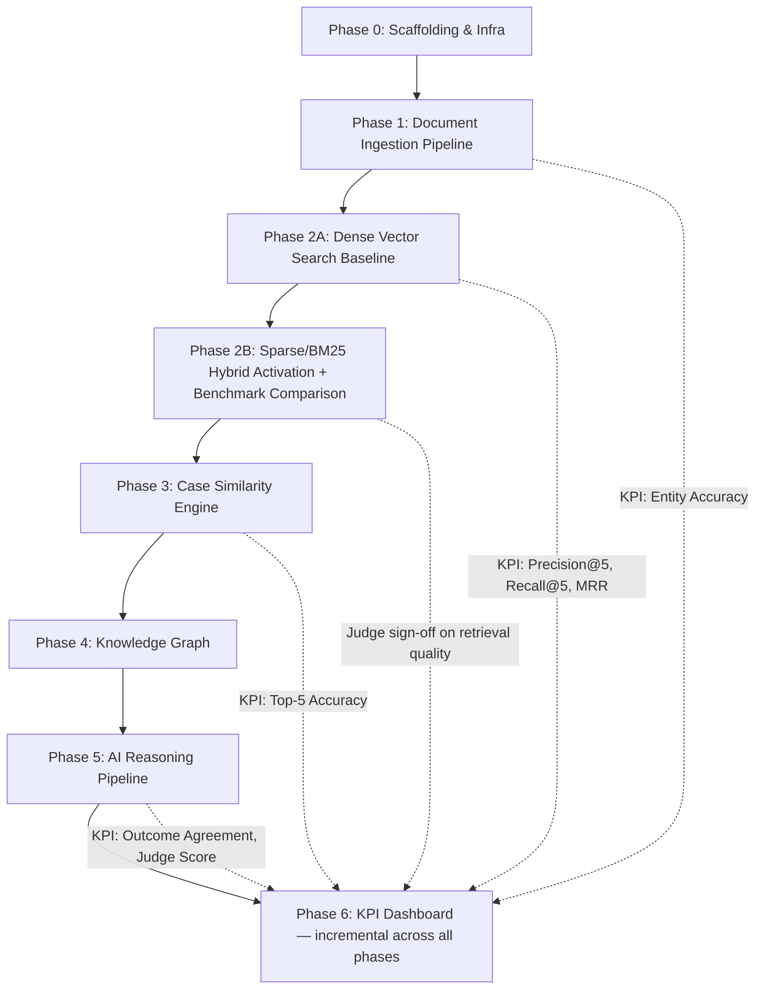
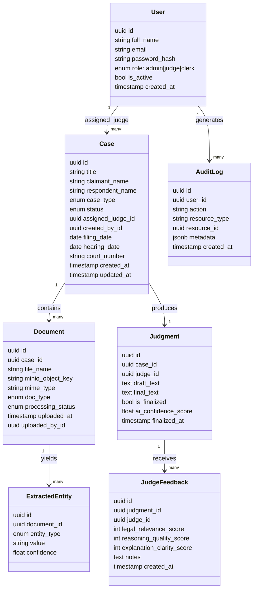
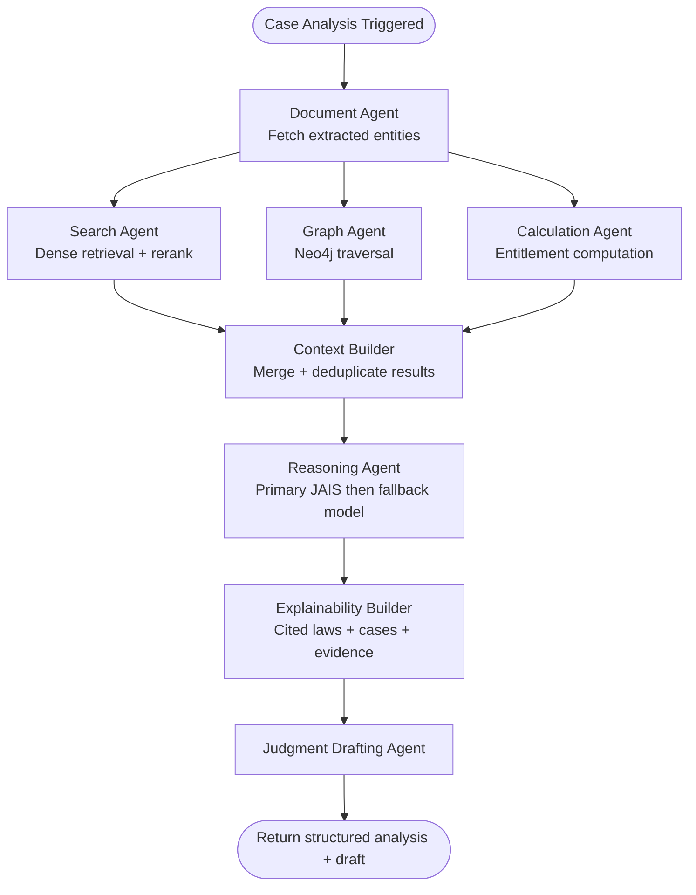

# Tech Plan — AI Judicial Assistant Platform

## 1. Architectural Approach

### Core Pattern: Layered Microservice Monolith (Modular Monolith → Service-Ready)

For the MVP, the backend is a **single FastAPI application** organized into well-bounded internal modules (Case, Document, User, AI, Evaluation). Each module owns its routes, services, and repository layer. This avoids premature microservice complexity while keeping boundaries clean enough to extract as independent services at scale.

**Rationale:** Greenfield + demo scale (~1,000 cases) does not justify distributed services overhead. Clean internal module boundaries are the scaling lever — not deployment topology.

---

### Key Architectural Decisions


| Decision              | Choice                                    | Rationale                                                                                                                         |
| --------------------- | ----------------------------------------- | --------------------------------------------------------------------------------------------------------------------------------- |
| **Backend framework** | FastAPI (async)                           | Native async support critical for non-blocking AI pipeline calls; automatic OpenAPI docs                                          |
| **AI orchestration**  | LangGraph (stateful graph)                | Models the multi-agent pipeline as a directed graph with conditional branching; supports retries and partial failure recovery     |
| **LLM**               | JAIS (self-hosted via Docker)             | Arabic-first model; keeps data on-premise; served via OpenAI-compatible REST API using `llama.cpp` or `vLLM`                      |
| **Embedding model**   | BGE-M3 (self-hosted)                      | Multilingual, strong Arabic support; served as a separate inference container                                                     |
| **Vector store**      | Qdrant                                    | Dense vector retrieval first (semantic baseline) with reranking; sparse/BM25 enabled in a follow-up activation step in this Epic after benchmark comparison and judge sign-off; Docker-native |
| **Graph DB**          | Neo4j                                     | Cypher query language is expressive for legal relationship traversal; official Docker image                                       |
| **Relational DB**     | PostgreSQL                                | Source of truth for all structured entities (cases, users, documents, judgments, audit logs)                                      |
| **Object storage**    | MinIO                                     | S3-compatible, Docker-native; stores raw document files                                                                           |
| **Frontend framework** | ReactJS (Vite + TypeScript) | SPA architecture with fast builds and strong component isolation |
| **Frontend routing** | React Router | Supports role-based route flows for Judge, Clerk, and Admin in a client-routed SPA |
| **Frontend API state** | React Query (preferred) / Redux Toolkit | React Query manages server state from FastAPI APIs; Redux Toolkit is optional for shared client state |
| **Frontend i18n** | i18next | Arabic/English localization with RTL support |
| **Frontend deployment** | Static build via Docker Nginx or reverse proxy | Simple static hosting compatible with FastAPI REST backend |
| **Auth**              | JWT (short-lived access + refresh tokens) | Stateless; RBAC claims embedded in token payload                                                                                  |


---

### Critical Trade-offs

**Self-hosted JAIS primary + local fallback model:**

- ✅ Keeps legal data on-premise
- ✅ Provides continuity when JAIS is unavailable or times out
- ⚠️ Under-10-second target is aggressive for CPU-only inference and must be validated early with benchmark runs
- **Decision:** Primary model is JAIS; fallback is a secondary local model with the same prompt/output contract. If JAIS exceeds timeout or is unavailable, orchestrator auto-falls back and records `model_used` in analysis metadata.

**LangGraph vs. simple sequential calls:**

- ✅ Handles conditional branching (e.g., skip graph query if Neo4j returns no matches)
- ✅ Makes failure-path behavior explicit at node level
- ⚠️ Durable checkpointing is intentionally deferred for MVP
- **Decision:** Use LangGraph in Phase 5 with lightweight in-memory retries only; failed workflows are manually re-triggered by judge/admin in MVP.

**Synchronous vs. Asynchronous AI pipeline:**

- ✅ Async execution avoids request timeouts and enables polling UX
- ⚠️ Adds operational complexity (status transitions and retry UX)
- **Decision:** Use FastAPI `BackgroundTasks` + `Case.status` state machine for MVP. Keep interface queue-compatible so durability can be added later without API redesign.

---

### Phased Build Sequence



---

### Failure Modes & Recovery


| Failure Point                              | Behaviour                                                                         | Recovery                                                                                                                   |
| ------------------------------------------ | --------------------------------------------------------------------------------- | -------------------------------------------------------------------------------------------------------------------------- |
| JAIS unavailable or timeout breach         | Orchestrator marks primary inference failure                                      | Auto-fallback to secondary local model; response includes `model_used=fallback` and incident log                           |
| Both primary and fallback models fail      | AI reasoning step fails                                                           | Return partial analysis (retrieved evidence/laws/calculations) with `reasoning_unavailable` status and manual retry action |
| Qdrant unavailable during search           | Search agent returns empty retrieval set                                          | Continue with graph + case facts only; mark low-confidence response                                                        |
| Neo4j unavailable                          | Graph agent returns empty graph context                                           | Continue reasoning without graph context; reduce confidence score                                                          |
| OCR fails on a document                    | Document marked `processing_failed`; case can still progress with remaining files | Admin/Clerk notified; failed document can be re-uploaded and reprocessed                                                   |
| MinIO upload fails                         | API returns `422`; no metadata commit                                             | Client retries; no partial state written                                                                                   |
| App process restarts during BackgroundTask | In-memory workflow state lost                                                     | Case remains `AIAnalysisPending`; judge/admin manually re-trigger analysis in MVP                                          |


---

## 2. Data Model

### PostgreSQL — Relational Schema



---

### Qdrant — Vector Collections


| Collection       | Embedding Source                    | Sparse Vector               | Payload Fields                                                  |
| ---------------- | ----------------------------------- | --------------------------- | --------------------------------------------------------------- |
| `legal_chunks`   | BGE-M3 on document text chunks      | Not enabled in MVP baseline | `case_id`, `document_id`, `chunk_index`, `doc_type`, `raw_text` |
| `case_summaries` | BGE-M3 on AI-generated case summary | —                           | `case_id`, `case_type`, `claimant`, `respondent`, `outcome`     |


MVP retrieval starts as **dense-only + reranker**. Sparse/BM25 is then activated in **Phase 2B within this Epic** after benchmark comparison and explicit judge sign-off.

---

### Neo4j — Knowledge Graph Schema

**Nodes:**


| Label        | Properties                                                        |
| ------------ | ----------------------------------------------------------------- |
| `Case`       | `case_id`, `title`, `case_type`, `outcome`, `filing_date`         |
| `Person`     | `person_id`, `name`, `role_values: claimant, respondent, witness` |
| `Company`    | `company_id`, `name`, `industry`                                  |
| `LawArticle` | `article_id`, `article_number`, `title`, `full_text`              |
| `Evidence`   | `evidence_id`, `doc_type`, `summary`                              |


**Relationships:**


| From         | Relationship       | To           |
| ------------ | ------------------ | ------------ |
| `Person`     | `EMPLOYED_BY`      | `Company`    |
| `Person`     | `IS_CLAIMANT_IN`   | `Case`       |
| `Company`    | `IS_RESPONDENT_IN` | `Case`       |
| `Case`       | `CITES`            | `LawArticle` |
| `Case`       | `HAS_EVIDENCE`     | `Evidence`   |
| `Case`       | `SIMILAR_TO`       | `Case`       |
| `LawArticle` | `CITED_BY`         | `Case`       |


**Graph population consistency policy (MVP):** simple dual-write with retries and eventual consistency. The ingestion pipeline writes PostgreSQL first, then Qdrant and Neo4j. On downstream write failure, the document is marked `partial_indexed`, retry attempts are scheduled, and a periodic reconciliation job detects/repairs drift between PostgreSQL, Qdrant, and Neo4j.

---

### MinIO — Bucket Structure


| Bucket            | Purpose                                |
| ----------------- | -------------------------------------- |
| `case-documents`  | Raw uploaded files (PDF, DOCX, images) |
| `ocr-output`      | Extracted text per document (JSON)     |
| `judgment-drafts` | AI-generated draft text files          |


---

## 3. Component Architecture

### System Component Map

```mermaid
graph TD
    FE[ReactJS SPA (Vite)]
    GW[FastAPI API Gateway\nJWT Auth + RBAC]

    subgraph Application Modules
        CM[Case Module]
        DM[Document Module]
        UM[User Module]
        AL[Audit Log Module]
        EV[Evaluation Module]
    end

    subgraph AI Services Layer
        DP[Document Processing Agent\nOCR + NER + Chunking]
        SA[Search Agent\nQdrant Dense + Reranker]
        GA[Graph Agent\nNeo4j Queries]
        CA[Calculation Agent\nEntitlement Logic]
        OR[AI Orchestrator\nLangGraph]
        RG[Reasoning Agent\nPrimary JAIS + Local Fallback + RAG]
        JD[Judgment Drafting Agent]
    end

    subgraph Data Layer
        PG[(PostgreSQL)]
        QD[(Qdrant)]
        NJ[(Neo4j)]
        MN[(MinIO)]
    end

    subgraph Inference Services
        JAIS[JAIS LLM Container]
        BGE[BGE-M3 Embedding Container]
    end

    FE --> GW
    GW --> CM
    GW --> DM
    GW --> UM
    GW --> AL
    GW --> EV

    CM --> PG
    DM --> MN
    DM --> DP
    DP --> BGE
    DP --> PG
    DP --> QD
    DP --> NJ

    CM --> OR
    OR --> SA
    OR --> GA
    OR --> CA
    OR --> RG
    RG --> JD
    RG --> JAIS

    SA --> QD
    SA --> BGE
    GA --> NJ
    EV --> PG
```

---

### Component Responsibilities

#### Phase 0 — Project Scaffolding


| Component        | Responsibility                                                                                               |
| ---------------- | ------------------------------------------------------------------------------------------------------------ |
| Docker Compose   | Orchestrates all services: FastAPI, React SPA static container (Vite build served via Nginx), PostgreSQL, Qdrant, Neo4j, MinIO, JAIS container, BGE container |
| FastAPI skeleton | Defines module structure, JWT middleware, RBAC dependency injection, health check routes                     |
| React SPA skeleton | Vite + TypeScript setup, React Router role-based routes (Judge/Clerk/Admin), auth context, i18next (AR/EN + RTL), API state layer via React Query (Redux Toolkit optional) |
| Alembic          | Database migration management for PostgreSQL schema evolution                                                |


#### Phase 1 — Document Processing Agent

Triggered on `POST /cases/{case_id}/documents` after MinIO upload completes.

**Pipeline (sequential, async background task):**

1. Retrieve file from MinIO
2. Tesseract OCR → raw text
3. NER extraction → `ExtractedEntity` records written to PostgreSQL
4. Text chunking (fixed-size with overlap, ~512 tokens)
5. BGE-M3 embedding per chunk
6. Upsert into Qdrant `legal_chunks` collection
7. Write entities to Neo4j graph
8. Update `Document.processing_status` → `completed`

**KPI emitted:** Entity extraction accuracy (tracked against a labeled validation set)

#### Phase 2 — Search Agent

Called by the AI Orchestrator or directly via `POST /search`.

**Interface:**

- Input: `query_text`, `case_id` (for context filtering), `top_k`
- Process: Embed query via BGE-M3 → Qdrant dense ANN retrieval → BGE Reranker top-K reranking
- Output: Ranked list of `{ chunk_text, document_id, case_id, score }`

**Phase 2A mode:** Dense-only retrieval baseline.

**Phase 2B activation:** Sparse/BM25 path is enabled behind a feature flag, benchmarked against dense baseline, and promoted only after judge sign-off.

**KPIs emitted:** Precision@5, Recall@5, MRR (evaluated against judge-labeled benchmark query set for both dense baseline and hybrid activation comparisons)

#### Phase 3 — Case Similarity Engine

Operates on `case_summaries` Qdrant collection.

**Interface:**

- Input: `case_id` of the active case
- Process: Retrieve active case's summary embedding → ANN search in `case_summaries` → filter by case_type → rerank → return Top-5
- Output: `{ similar_case_id, similarity_score, case_title, outcome }[]`
- Confidence score = weighted blend: `0.5 × embedding_similarity + 0.3 × reranker_score + 0.2 × graph_match_score`

**KPIs emitted:** Top-5 accuracy, average similarity score

#### Phase 4 — Graph Agent

**Interface:**

- Input: `case_id`, query intent (e.g., `find_relevant_laws`, `find_similar_companies`)
- Process: Cypher queries against Neo4j — traverse `CITES` and `SIMILAR_TO` relationships; return law articles and related cases
- Output: `{ law_articles: LawArticle[], related_cases: Case[], graph_confidence: float }`

#### Phase 5 — AI Orchestrator (LangGraph) + Reasoning Agent

The orchestrator wires agents into a directed graph:



**Reasoning Agent prompt contract:**

- System prompt: UAE Labor Law context + role instruction in Arabic + English
- User prompt: Case facts + retrieved chunks + law articles + similar cases + calculation result
- Output schema: `{ outcome, reasoning, cited_laws, cited_cases, confidence, draft_judgment, model_used }`

#### Phase 6 — Evaluation Module (Incremental)

Collects metrics after each phase goes live:


| Phase   | Metrics Added                                                                |
| ------- | ---------------------------------------------------------------------------- |
| Phase 1 | Entity extraction accuracy per entity type                                   |
| Phase 2 | Precision@5, Recall@5, MRR per query                                         |
| Phase 3 | Top-5 accuracy, avg similarity score                                         |
| Phase 5 | Outcome agreement %, judge feedback scores (1–5), search latency, AI latency |


**Release gate (required before judge-reliant rollout):**

- Use judge-labeled UAE labor-law benchmark set
- Compare dense baseline and hybrid activation quality with recorded KPI trends
- Require explicit judge sign-off to promote retrieval/similarity features from evaluation mode to decision-support defaults
- Numeric threshold values are intentionally deferred for MVP and will be finalized in a later hardening cycle

**Storage:** All evaluation events written to a dedicated PostgreSQL `evaluation_events` table with `metric_type`, `value`, `phase`, and `created_at`.

**Dashboard API:** `GET /admin/metrics` aggregates by metric type and time window; consumed by the React KPI dashboard visible to Admin.

---

### API Surface Summary


| Method   | Path                       | Role                | Purpose                       |
| -------- | -------------------------- | ------------------- | ----------------------------- |
| `POST`   | `/auth/login`              | All                 | JWT token issuance            |
| `POST`   | `/auth/refresh`            | All                 | Token refresh                 |
| `GET`    | `/cases`                   | Judge, Clerk, Admin | List cases (role-scoped filtering) |
| `POST`   | `/cases`                   | Judge, Clerk, Admin | Create case                   |
| `GET`    | `/cases/{id}`              | Judge, Clerk, Admin | Get case detail (role-scoped access) |
| `PATCH`  | `/cases/{id}`              | Clerk, Admin        | Update metadata               |
| `PATCH`  | `/cases/{id}/assign`       | Admin               | Assign to judge               |
| `POST`   | `/cases/{id}/documents`    | Judge, Clerk, Admin | Upload document               |
| `PATCH`  | `/documents/{id}/metadata` | Clerk               | Tag document type             |
| `POST`   | `/cases/{id}/analyze`      | Judge               | Trigger AI analysis           |
| `GET`    | `/cases/{id}/analysis`     | Judge               | Poll analysis status + result |
| `POST`   | `/cases/{id}/draft`        | Judge               | Generate judgment draft       |
| `POST`   | `/cases/{id}/judgment`     | Judge               | Finalize judgment             |
| `POST`   | `/cases/{id}/feedback`     | Judge               | Submit AI feedback scores     |
| `GET`    | `/admin/users`             | Admin               | List users                    |
| `POST`   | `/admin/users`             | Admin               | Create user                   |
| `DELETE` | `/admin/users/{id}`        | Admin               | Deactivate user               |
| `GET`    | `/admin/metrics`           | Admin               | KPI dashboard data            |
| `GET`    | `/admin/audit-logs`        | Admin               | Audit log stream              |


---

*References:* spec:46b3d4d1-40cc-4758-a015-fc62c3427f7b/f4822f2a-3a9d-4578-8c61-898f407b9767 *— Epic Brief ·* spec:46b3d4d1-40cc-4758-a015-fc62c3427f7b/7528216d-acf7-47f2-b290-25d12e35e118 *— Core Flows ·* file:ai-judicial-assistant/docs/ai_judicial_assistant_architecture_full.md *— Architecture*
